# How Many Positions on a Rubik's Cube?

## A fun lesson in permutations.

The Rubik's Cube is a challenging puzzle to solve, largely because there are so
many positions. Wouldn't it be fun to know exactly how many positions there
are? Wouldn't it be even *more* fun to know how to calculate that number for
yourself?

# Back To The Basics

Imagine we have three marbles and each marble is a different color. One is red,
another is green, and the third is blue. If we were to place the marbles in a
row on the table in front of us, how would we arrange them?

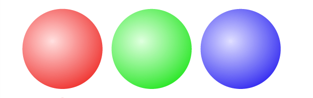

The ordering that we've selected is just one possible position of many. We
might have chosen to put green first instead of red. Each of these positions is
a [*permutation*][permutation] of our marbles. If we were to rearrange the
marbles, then we would find another permutation.

> "A **permutation** of a set of objects is an arrangement of those objects
> into a particular order." - wikipedia

In order to count how many positions we have for the Rubik's Cube, we will
first learn how to count permutations for our set of marbles.

## Counting Permutations

We intuitively know that our set of three marbles has several different
permutations, but exactly how many are there? One way to count is to rearrange
the marbles on a table until we've found each permutation. Doing this, we can
see that we have **six permutations**.

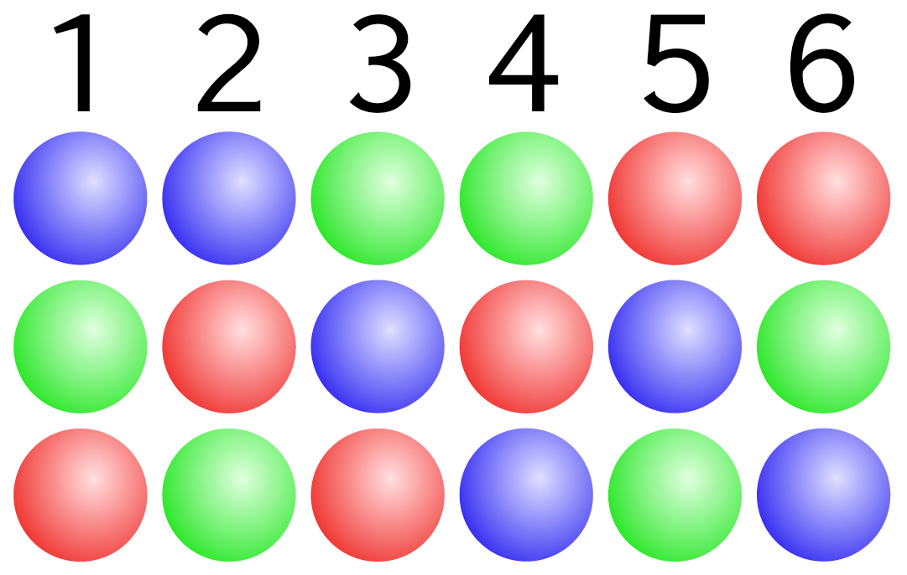

## When We've Lost Our Marbles

Visualizing each permutation works well when we only have three marbles, but
what if we wanted to count permutations for a bag of 500 marbles? We'll need a
different strategy.

There's a nice mathematical trick we can use for counting permutations called
the [*factorial*][factorial]. Given *n* items, the factorial of *n* is equal to
the number of permutations of *n*.

> "The **factorial** of a non-negative integer n, denoted by n!, is the product
> of all positive integers less than or equal to n." - wikipedia

Since we have three marbles, we can calculate the total number of permutations
by calculating **three factorial**.

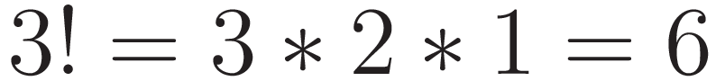

# Getting Oriented

A marble does not have an orientation. It cannot be flipped or rotated. It
always appears the same no matter how it's placed on the table. When we counted
the the number of positions for our marbles, all we cared about was their
permutation.

What if we wanted to calculate the total number of positions for a set of
**three playing cards**?

Initially, the problem looks the same. We have three cards and know that they
can be arranged in **three factorial** different permutations, just like the
marbles.

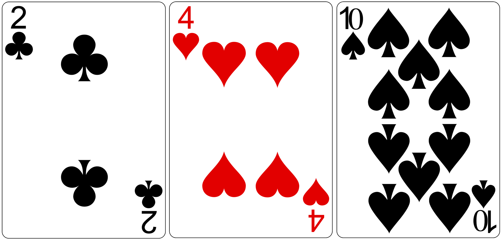

Playing cards, however, *do* have an orientation. We can flip any of the three
cards and we'll end up with a *different* position. In order to calculate the
total number of positions, we'll need to factor in **both the permutation and
orientation** of each card.

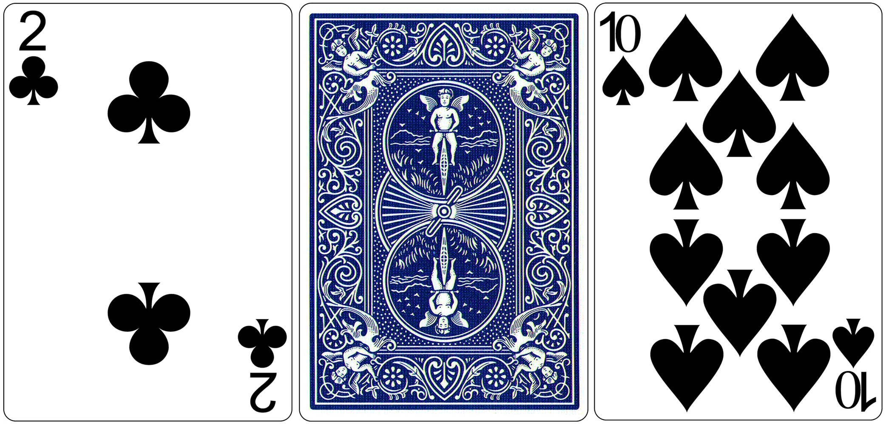

We've already learned how to calculate the total number of permutations as
**three factorial**. Next, we'll see how to calculate the total number of
orientations for each position.

We have **three playing cards** and each card has **two possible
orientations**, face *up* or face *down*. For each of our **three factorial
permutations**, we are able to reach all of these orientations.

How many total orientations are there for one permutation of our set of three
cards? We could count them using the image above, but it's faster to calculate.

We have **three playing cards** and each card has **two orientations**. The
total number of orientations for one permutation of the cards can be calculated
as the **third power of two**.

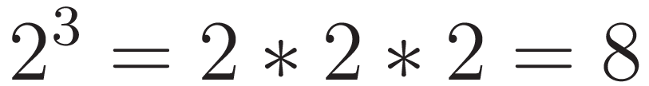

## Total Positions for Three Cards

We've determined the total number of permutations for our cards is **three
factorial** and the total number of orientations for each of those permutations
is the **third power of two**. Calculating the number of positions is done by
multiplying the number of permutations by the number of orientations.

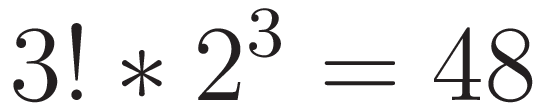

A set of three playing cards has 48 possible positions when all permutations
and orientations are considered.

# Understanding the Rubik's Cube

We now have all the knowledge we need to calculate the total number of
positions for the Rubik's Cube. We know that, given a set of *n* items with *p*
orientations, the total number of positions for that set of items can be
calculated.

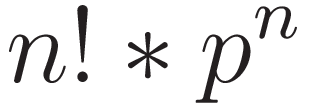

Once we understand how the Rubik's Cube is built, we can apply this formula and
calculate the total number of positions.

## Anatomy of a Rubik's Cube

The Rubik's Cube has six sides and each side has nine squares, but this is not
a good way to think about the cube when trying to count the number of
positions. Instead, we need to understand [how the cube is built][video], what
types of pieces there are, and how each piece moves around the puzzle.

[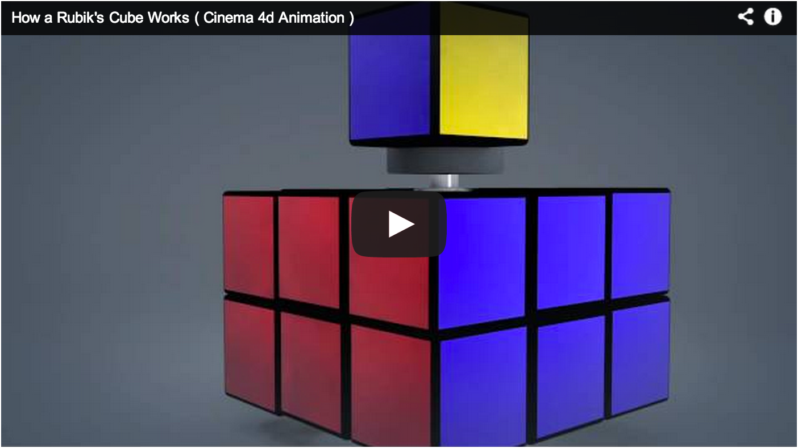][video]

It's important to understand that the Rubik's Cube has **three types of
pieces**. Each behaves differently as we turn the sides of the cube. We'll keep
this in mind as we do our calculations.

# Calculating Positions

The total number of positions for the Rubik's Cube can be calculated by looking
at each of the three types of pieces separately.

## Center Positions

There are six center pieces and they are located at the center of each face of
the Rubik's Cube. [As we learned][video], the center pieces are part of a fixed
axle that does not move. All the other pieces move *around* the center pieces.
This means that the center pieces have **one permutation** and **one
orientation**.

Intuitively we know that something with *one* permutations and *one*
orientation has a **single position**, but we can verify by plugging these
numbers into our equation.

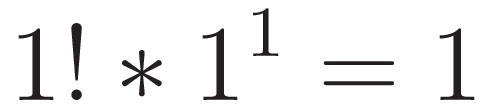
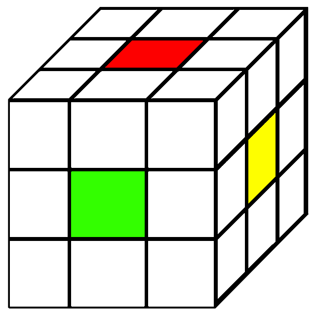

## Corner Positions

Every cube has **eight corners** and the Rubik's Cube is no exception. Unlike
the centers, each corner piece can be moved and rotated.  Since we have eight
corners, our total number of permutations for these pieces is **eight
factorial**.

To figure out the number of orientations for a single piece, we need to count
the number of stickers. A corner pieces has three stickers, so it must have
**three orientations**. As we learned, this means the total number of
orientations for each position of the corners is the **eighth power of three**.

With these numbers, we can calculate the total number of positions for the
corner pieces.

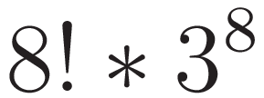
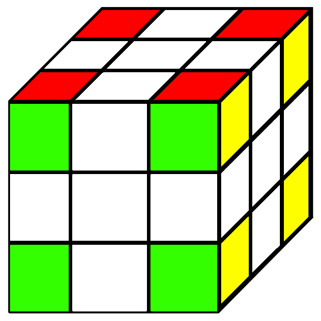

## Edge Positions

A Rubik's Cube has **twelve edge pieces** and each piece may be moved or
flipped.  We can calculate the total number of permutations for these pieces as
**twelve factorial**.

We can use the same method as we did for the corners to determine the number of
orientations for a single edge piece. An edge piece has two stickers, so it
must have **two orientations**. This means the total number of orientations for
each position of the edges is the **twelfth power of two**.

With these numbers, we can calculate the total number of positions for the edge
pieces.

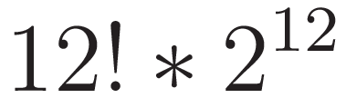

## Putting It All Together

We've calculated the number of positions for the center pieces, the corner
pieces, and the edge pieces. The final step to finding the total positions for
the entire Rubik's Cube is multiplying these numbers together.

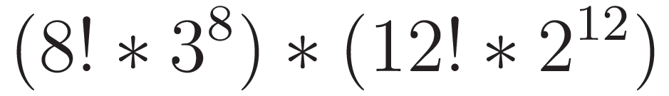

## But Wait, There's More

We have successfully calculated the number of positions, but we made one fatal
assumption; our calculations assume that we can take the cube apart. This is
*cheating*. Not every position of the Rubik's Cube is possible if we limit
ourselves to turning the sides.

> "there is no sequence of moves that will swap a single pair of pieces or
> rotate a single corner or edge cube" - wikipedia

Because of the limitations of the Rubik's Cube, only [**1 in 12**][rubiks-cube]
of every position is reachable by turning the sides of the cube. We can factor
this in to our equation and settle on the total number of *legal* positions of
the Rubik's Cube.

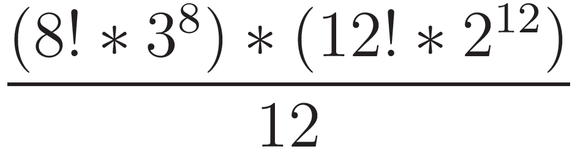

# How Large Is That?

There are over 43 quintillion legal positions of the Rubik's Cube.

- It would take **thirteen hundred million years** to see every position if you
  were able to view one thousand per second.
- If we stacked 43 quintillion pennies, the stack would be tall enough to reach
  the sun and return to the earth **four thousand billion times**.

Follow [@chrishunt][chrishunt] for updates.

[chrishunt]: https://twitter.com/chrishunt
[factorial]: http://en.wikipedia.org/wiki/Factorial
[permutation]: http://en.wikipedia.org/wiki/Permutation
[video]: https://www.youtube.com/watch?v=1p0qN1_qWoA
[rubiks-cube]: http://en.wikipedia.org/wiki/Rubiks_Cube
